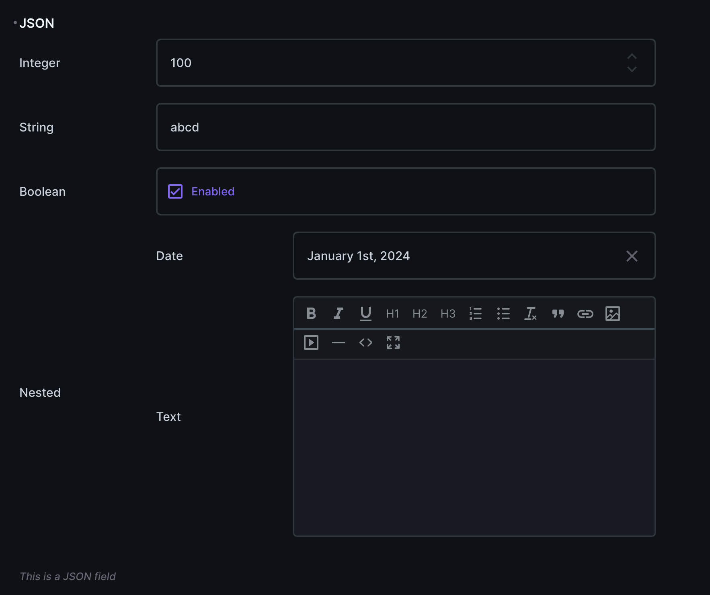

# Directus Extension: Key-Value Interface

This is a custom interface for Directus that allows you to edit key-value pairs with schema and type inference.



## Features

- Edit JSON value in a key-value format
- Automatically infer types for unknown keys
- Can display as an object or a list
- Support for `schema` and `allowOther` options

## Installation

To install this extension, you can use npm:

```sh
npm install directus-extension-key-value-interface
```

## Changelog

For the detailed changes for each version, check out the [CHANGELOG.md](CHANGELOG.md).

## License

This project is licensed under the MIT License. See the [LICENSE](LICENSE) file for details.
